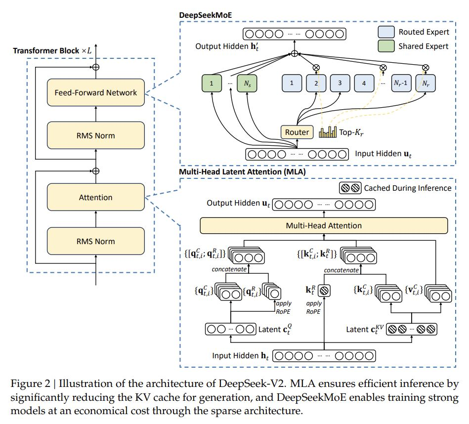
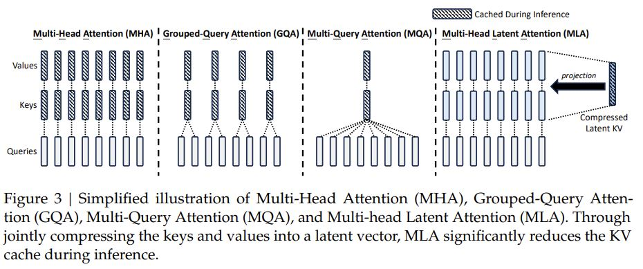
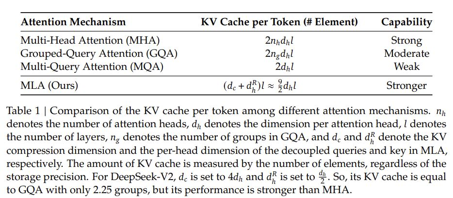

# DeepSeek-V2: A Strong, Economical, and Efficient Mixture-of-Experts Language Model

## Core Idea
[deepseek] 低秩压缩对查询的作用主要体现在减少训练时的激活内存占用。通过将查询压缩为低维潜在向量，MLA显著减少了查询生成过程中中间结果的存储开销，从而降低了激活内存的占用。尽管低秩压缩不能减少KV缓存，但它在训练效率优化方面具有重要作用。

关键点总结：

- 低秩压缩通过减少查询的中间结果存储，降低了激活内存的占用。

- 低秩压缩在反向传播时减少了内存带宽的压力，提升了训练效率。

- 低秩压缩对查询的优化并不能减少KV缓存，因为KV缓存是独立于查询的。

## Core Image

## Useful Extensions
[知乎] [缓存与效果的极限拉扯：从MHA、MQA、GQA到MLA](https://zhuanlan.zhihu.com/p/700588653)