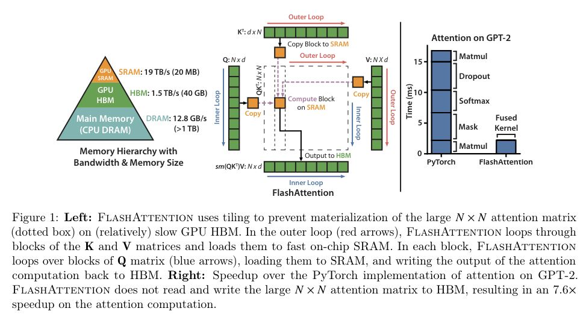
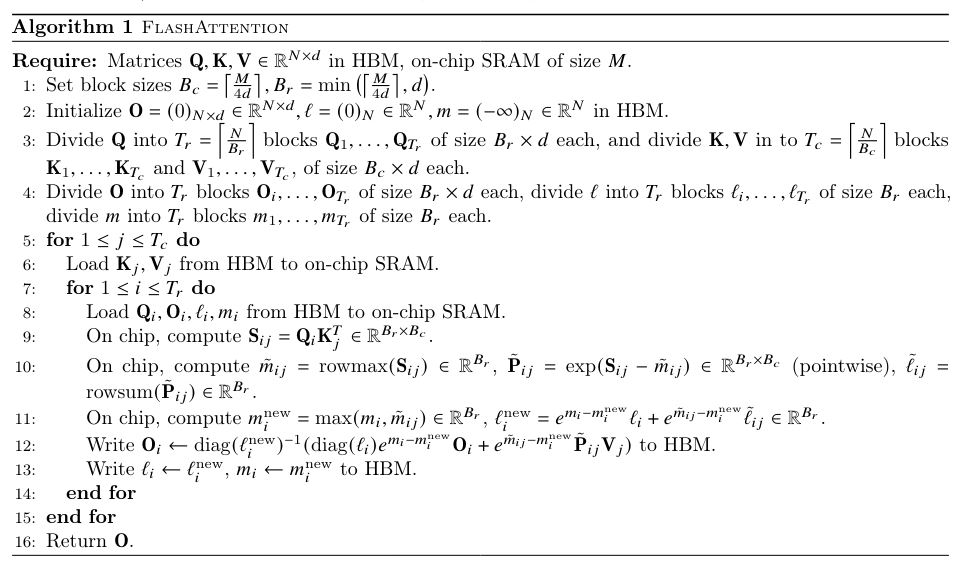

# FlashAttention: Fast and Memory-Efficient Exact Attention with IO-Awareness

## Core Idea
Conclusions: 
- FlashAttention: an IO-aware exact attention algorithm that uses tiling to reduce the number of memory reads/writes between GPU high bandwidth memory (HBM) and GPU on-chip SRAM. 
- IO complexity: it requires fewer HBM accesses than standard attention, and is optimal for a range of SRAM sizes.

## Core Image

## Useful Extensions
[知乎] [[Attention优化][2w字]🔥原理&图解: 从Online-Softmax到FlashAttention V1/V2/V3](https://zhuanlan.zhihu.com/p/668888063)