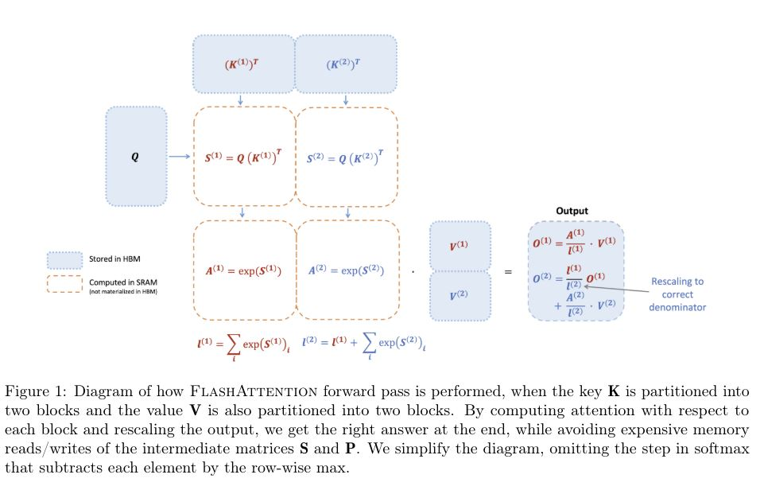
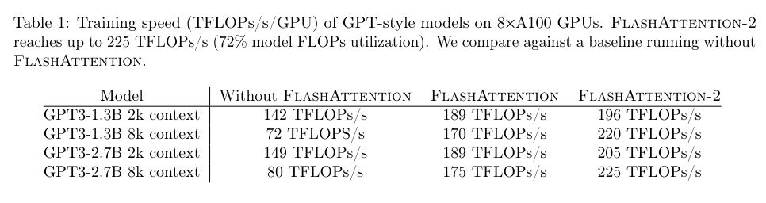

# FlashAttention-2: Faster Attention with Better Parallelism and Work Partitioning

## Core Idea
Contributions: 
- tweak the algorithm to reduce the number of non-matmul FLOPs
  - flash attention: Online softmax instead computes “local” softmax with respect to each block and rescale to get the right output at the end
  - flash attention 2: Only at the every end of the loop do we scale the final to get the right output
- parallelize the attention computation
  - additionally parallelize over the sequence length dimension (and schedule them on different thread blocks that do not need to communicate with each other)
  - swapping the order of the loop (outer loop over row blocks and inner loop over column blocks, instead of the other way round in the original FlashAttention paper)
- within each thread block, distribute the work between warps to reduce communication through shared memory

## Core Image

## Useful Extensions
[知乎] [[Attention优化][2w字]🔥原理&图解: 从Online-Softmax到FlashAttention V1/V2/V3](https://zhuanlan.zhihu.com/p/668888063)