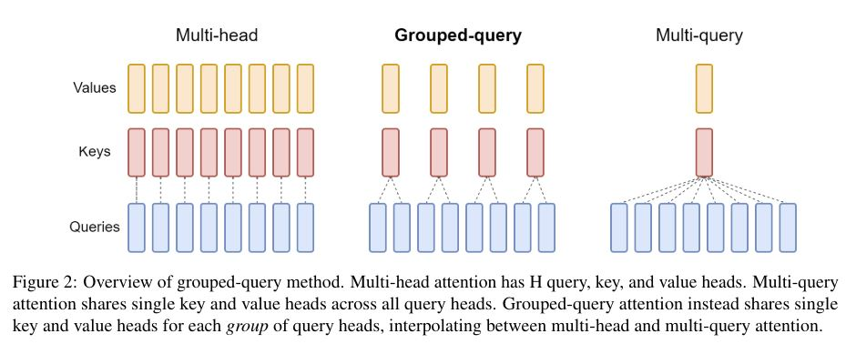

# GQA: Training Generalized Multi-Query Transformer Models from Multi-Head Checkpoints

## Core Idea
[kimi] MHA提供了最丰富的表示能力，但可能在推理速度上较慢；MQA在解码速度上有显著优势，但可能会牺牲一些模型质量；而GQA则试图在这两者之间找到平衡，通过分组查询头来减少内存带宽需求，同时尽量保持模型的质量。

## Core Image

## Useful Extensions