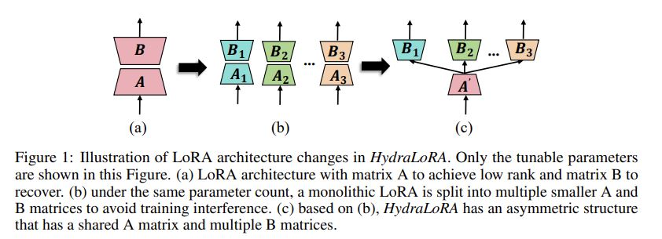
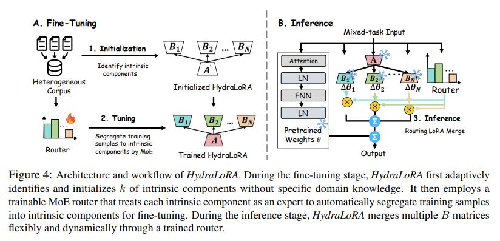

# HydraLoRA: An Asymmetric LoRA Architecture for Efficient Fine-Tuning

## Core Idea
Observations:
- with the same parameter count, rather than employing a single LoRA for the entire domain dataset, it proves more effective to deploy multiple, smaller LoRA heads, each dedicated to a specifc downstream task
- when multiple LoRA heads are trained individually on different data, the parameters of matrix A from different heads tend to converge, while those of matrix B are distinguishable

Contributions:
- introduce a novel architecture HydraLoRA that features an asymmetric
structure with a shared matrix for all samples and distinct matrices for each intrinsic component

## Core Image

## Useful Extensions
[知乎] [LoRA这种微调方法和全参数比起来有什么劣势吗？](https://www.zhihu.com/question/608674675/answer/4624417890)