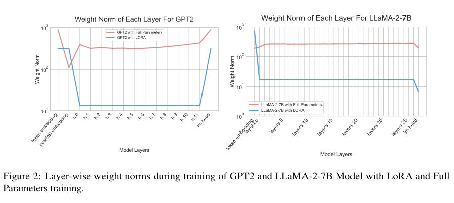

# LISA: Layerwise Importance Sampling for Memory-Efficient Large Language Model Fine-Tuning

## Core Idea
[kimi] LoRA和全参数微调在层间重视程度上的差异体现在它们对模型参数更新的策略上：LoRA通过引入低秩矩阵来有选择性地更新参数，而全参数微调则对所有参数进行更新。LISA算法通过重要性采样策略，结合了这两种方法的优点，实现了在内存效率和性能提升之间更好的平衡。

## Core Image

## Useful Extensions