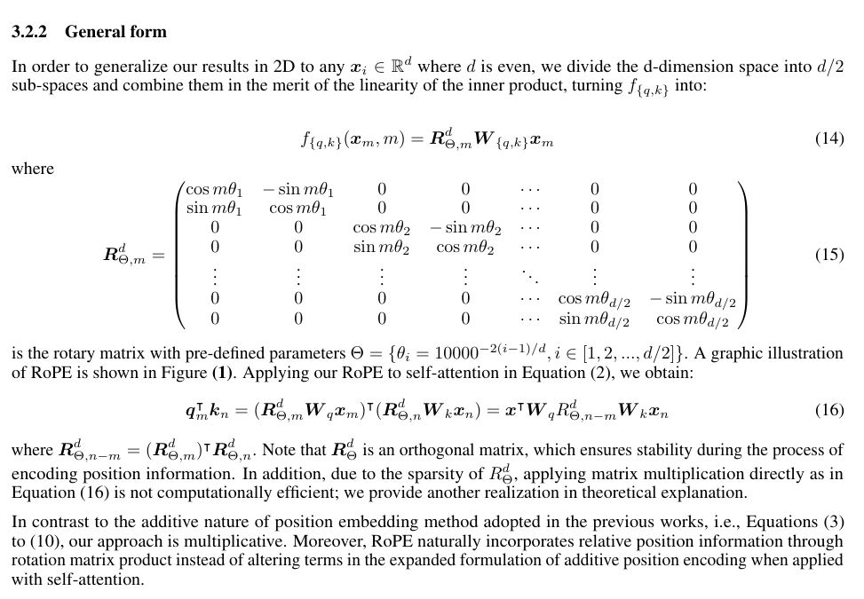
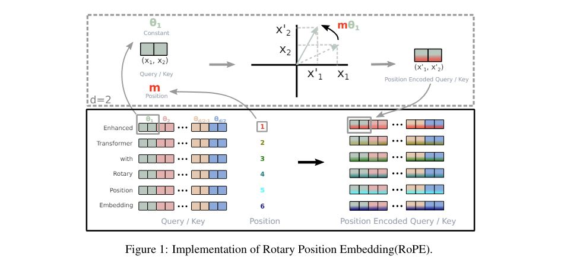
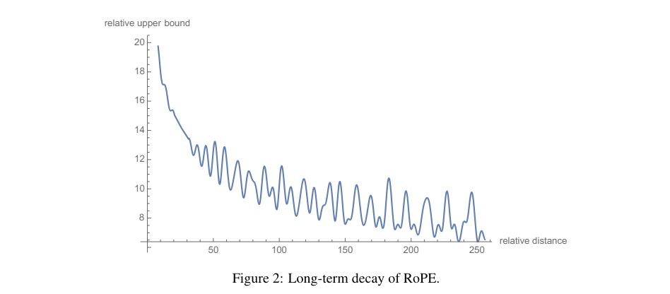

# RoFormer: Enhanced Transformer with Rotary Position Embedding

## Core Idea
[kimi] RoPE通过旋转矩阵直接在自注意力机制中编码位置信息，而ALiBi则通过调整注意力得分来实现。

[kimi] ALiBi（Attention with Linear Biases）和RoPE（Rotary Position Embedding）是两种不同的方法，用于在Transformer模型中处理位置信息，特别是在处理长上下文窗口时。它们在长上下文推理方面的表现差异主要源于它们的设计和实现方式。
- ALiBi在长上下文窗口上推理的能力：ALiBi通过在注意力机制中引入与查询和键之间距离成比例的线性偏置来调整注意力得分。这种方法不依赖于位置嵌入，而是通过在注意力得分中添加一个静态、非学习的偏置来实现。这种偏置随着查询和键之间距离的增加而线性增加，使得模型在处理长序列时能够更加关注序列的局部信息，同时仍然保持对全局上下文的感知。ALiBi的设计允许模型在训练时学习到序列的一般模式，并在推理时将这些模式应用到更长的序列上，即使它没有在训练期间看到过这么长的序列。
- RoPE外推性质相对较弱的原因：RoPE通过使用旋转矩阵来编码绝对位置，并将显式的相对位置依赖性纳入自注意力公式中。这种方法在自注意力机制中注入位置信息，但它的外推性能可能受限于其在训练时学习到的位置编码的泛化能力。当模型尝试处理超出其训练时上下文窗口的序列时，RoPE可能无法有效地利用其在训练期间学到的位置信息，因为这些位置编码可能没有为未见过的更长序列做好准备。此外，RoPE的注意力得分可能在超出训练窗口的序列中变得不稳定，导致模型性能下降。
总的来说，ALiBi的设计使其能够在长上下文窗口上进行有效的推理，而RoPE在外推到更长序列时可能会遇到挑战。这主要是因为ALiBi通过引入线性偏置来调整注意力得分，而不是依赖于可能无法泛化到更长序列的位置嵌入。

## Core Image

## Useful Extensions