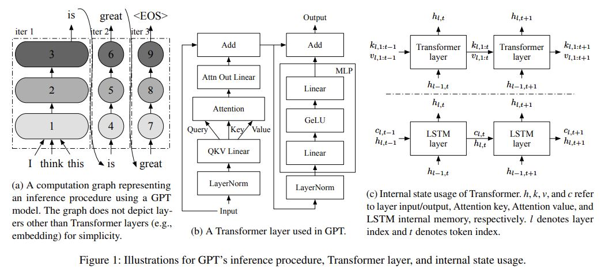
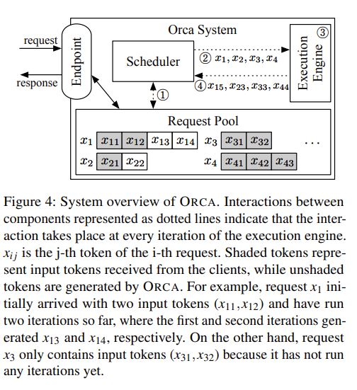
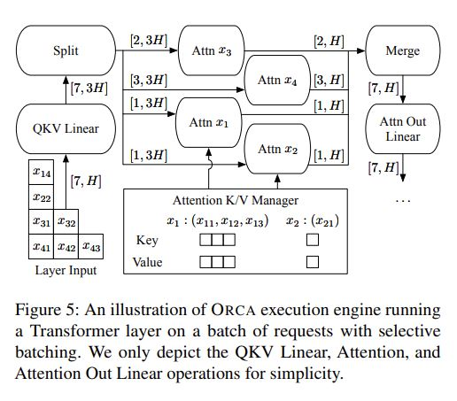
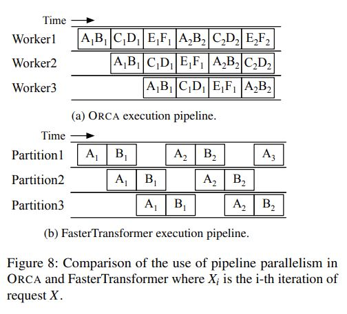
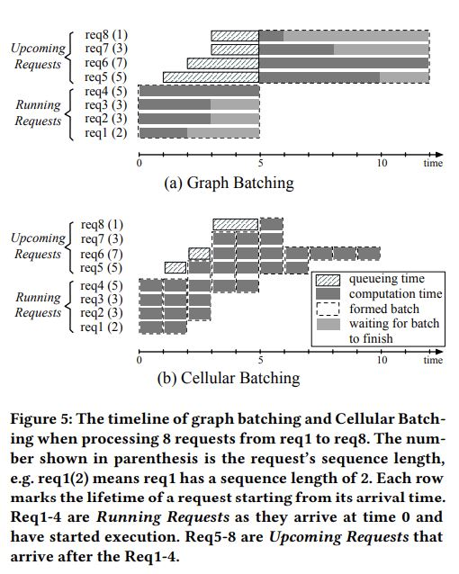

# Orca: A Distributed Serving System for Transformer-Based Generative Models

## Core Idea
Conclusions:

We present iteration-level scheduling with selective batching, a novel approach that achieves low latency and high throughput for serving Transformer-based generative models.  
- Iteration-level scheduling makes the scheduler interact with the execution engine at the granularity of iteration instead of request 
- Selective batching enables batching arbitrary requests processing tokens at different positions,
which is crucial for applying batching with iteration-level scheduling

[kimi] 图8在论文中用于比较ORCA系统与FasterTransformer在处理请求时的流水线并行性。以下是对图8的详解：

图8a: ORCA执行流水线
- **描述**: 展示了ORCA系统中的流水线执行方式。
- **时间轴**: X轴表示时间的进展。
- **工作进程**: Y轴展示了三个不同的工作进程（Worker1、Worker2、Worker3），它们可以并行处理请求。
- **请求批次**: 每一对字母（如A1B1、A2B2等）代表一个请求批次，其中每个字母代表一个请求，后面的数字代表该请求的迭代次数。
- **流水线操作**: ORCA允许工作进程在每个迭代后立即处理新的请求，不需要等待整个批次完成。这允许流水线连续运行，提高了效率。

图8b: FasterTransformer执行流水线
- **描述**: 展示了FasterTransformer的流水线执行方式。
- **时间轴**: 与图8a共享相同的X轴，表示时间。
- **工作进程**: Y轴展示了两个工作进程（Worker1、Worker2）。
- **微批次**: FasterTransformer将请求批次分割为更小的微批次（microbatches），例如将批次AB分割为A和B两个微批次。
- **流水线限制**: 由于FasterTransformer基于请求级调度，它必须等待当前微批次处理完成后才能开始新的微批次，这可能导致流水线中的空闲时间（气泡）。

关键点
- **流水线并行性**: ORCA通过迭代级调度实现了更高效的流水线并行性，每个工作进程可以在任何时间点开始处理新的请求，而FasterTransformer则受限于其请求级调度，需要在微批次之间进行等待。
- **效率比较**: ORCA的设计允许它在处理请求时更加灵活，减少了等待时间，提高了整体的吞吐量。相比之下，FasterTransformer可能在处理不同长度或不同阶段的请求时效率较低。

## Core Image

Reference from Cellular Batching:

## Useful Extensions
Presentation: https://www.usenix.org/conference/osdi22/presentation/yu

Web: https://holly-hardware-5d5.notion.site/Orca-A-Distributed-Serving-System-for-Transformer-Based-Generative-Models-b848a92f26174129a3f10f82205e7079

