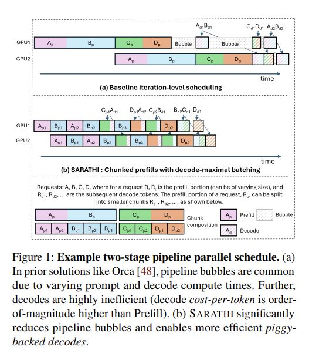
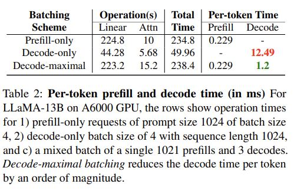

# SARATHI: Efficient LLM Inference by Piggybacking Decodes with Chunked Prefills

## Core Idea
现存问题：
- suboptimal GPU utilization due to lack of parallelism and memory-bound nature of decode phase
- signifcant pipeline bubbles due to inconsistent prefill and decode times across different iterations, leading to microbatch imbalance  

主要改进：
- Decode-maximal batching improves GPU utilization by piggybacking decodes with preflls,
which converts the memory-bound decode phase to be compute bound.   
- Chunked-preflls helps with making more preflls available for decodes to piggyback, and also provides for a uniform unit of work which helps significantly reduce pipeline bubbles.

**问题：跟vLLM联系起来。vLLM将KVcache存储分块（输出不定长），本文将prefill计算分块（输入不定长），感觉有相似的思想。**

[kimi] 确实，vLLM和本文提出的SARATHI系统在处理大型语言模型（LLM）时面临的挑战时，展现了一些相似的思想，尤其是在优化内存管理和计算效率方面。以下是两者之间的相似之处和它们各自的关注点：

vLLM:
1. 动态内存分配：vLLM提出了一种动态内存分配策略，用于处理自回归解码中的KV缓存（Key-Value Cache）。因为在自回归解码中，输出的长度是不确定的，所以预先分配足够的内存可能会导致资源浪费或限制批处理大小。

2. 按需增长：vLLM通过仅在需要时分配内存，允许模型处理更长的序列，同时优化内存使用。

3. 虚拟内存抽象：vLLM的动态内存分配策略受到虚拟内存抽象的启发，允许系统更灵活地处理不同长度的请求。

SARATHI:
1. 分块Prefill计算：SARATHI通过将prefill计算分块，允许系统更有效地处理输入长度不定的序列。这使得每个chunk可以独立计算，从而提高了计算资源的利用率。

2. 动态调度：SARATHI利用chunked-prefills和decode-maximal batching技术，动态地调度计算任务，以最大化GPU的计算效率并减少流水线气泡。

3. 适应性：SARATHI的设计允许它适应不同长度的输入序列，通过chunking技术优化了对输入序列的处理。

相似之处:
- 优化内存和计算资源：两者都旨在优化LLM在处理可变长度序列时的内存和计算资源使用。
- 动态处理：vLLM和SARATHI都采用了动态处理方法来适应不同长度的序列，vLLM通过动态内存分配，SARATHI通过动态计算调度。
- 提高效率：两种方法都致力于提高LLM推理阶段的效率，无论是通过减少内存占用还是通过提高计算吞吐量。

区别:
- 关注点不同：vLLM主要关注于解码阶段的内存优化，而SARATHI关注于整个推理流程，特别是prefill和decode阶段的计算效率。
- 实现方式：vLLM通过内存管理的创新来实现优化，SARATHI则通过计算调度和执行策略的创新。

综上所述，尽管vLLM和SARATHI在具体的实现和关注点上有所不同，但它们都采用了创新的方法来解决LLM在不同工作负载下面临的效率和资源管理问题。这种思想上的相似性体现了深度学习系统设计中对灵活性和效率的不断追求。

## Core Image

## Useful Extensions
