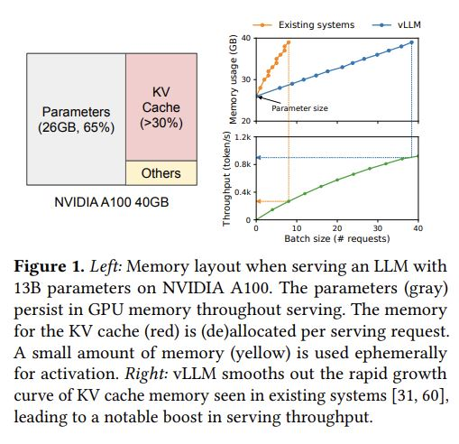
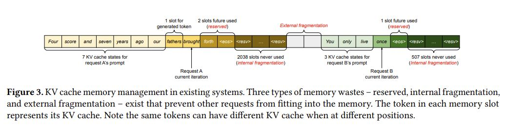
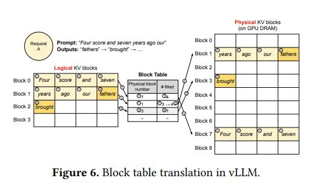
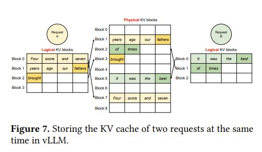

# Efficient Memory Management for Large Language Model Serving with PagedAttention

## Core Idea
PagedAttention：
- an attention algorithm inspired by the operating
system’s (OS) solution to memory fragmentation and sharing: virtual memory with paging.
- PagedAttention divides the request’s KV cache into blocks, each of which can contain
the attention keys and values of a fixed number of tokens. 
- In PagedAttention, the blocks for the KV cache are not necessarily stored in contiguous space. Therefore, we can manage the KV cache in a more flexible way as in OS’s virtual memory: one can think of blocks as pages, tokens as bytes, and requests as processes. This design alleviates internal fragmentation by using relatively small blocks and allocating them on demand. Moreover, it eliminates external fragmentation as all blocks have the same size.
- Finally, it enables memory sharing at the granularity of a block, across the different sequences associated with the same request or even across the different requests.

主要贡献：
- We identify the challenges in memory allocation in serving LLMs and quantify their impact on serving performance.
- We propose PagedAttention, an attention algorithm that operates on KV cache stored in non-contiguous paged memory, which is inspired by the virtual memory and paging in OS.
- We design and implement vLLM, a distributed LLM serving engine built on top of PagedAttention. 

注意点：
-  Note that the KV cache of one token depends on all its previous tokens. This means that the
KV cache of the same token appearing at different positions in a sequence will be different.

Decoding Scenarios:
- parallel samping
- beam search
- shared prefix

## Core Image

## Useful Extensions
Code: https://github.com/vllm-project/vllm

Docs: https://docs.vllm.ai/en/latest/

Blog: https://blog.vllm.ai/2023/06/20/vllm.html

[知乎] [大模型推理加速工具：vLLM](https://zhuanlan.zhihu.com/p/642802585)

[知乎] [图解大模型计算加速系列之：vLLM核心技术PagedAttention原理](https://zhuanlan.zhihu.com/p/691038809)