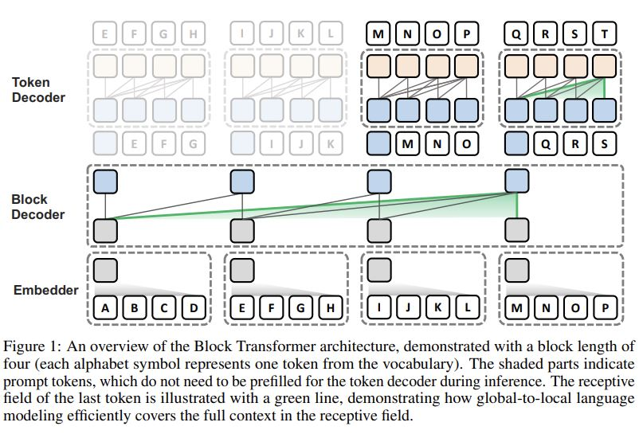
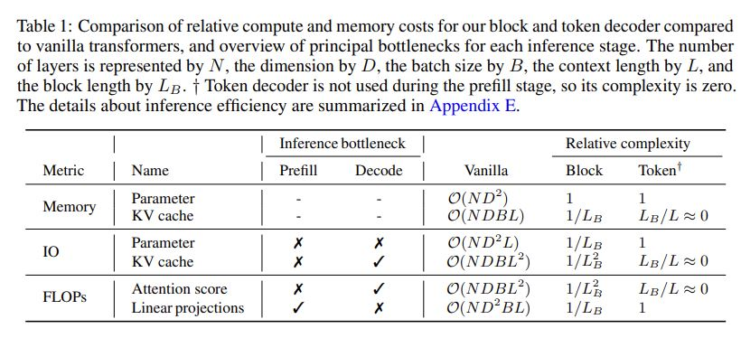

# Block Transformer: Global-to-Local Language Modeling for Fast Inference

## Core Idea
[kimi] 这篇论文介绍了一种新型的Transformer架构——Block Transformer，旨在通过分层的全局到局部的语言建模来减轻自注意力机制带来的推理瓶颈。

[kimi] Block Transformer 和 Mistral 的 Sliding Window Attention (SWA) 在处理全局注意力方面确实存在区别。
- **Block Transformer**：通过块级别的自注意力和上下文嵌入，Block Transformer能够在一定程度上模拟全局注意力，但这种全局信息的获取是通过块内的第一个token间接实现的。这种方法在提高推理效率方面非常有效，但可能在处理需要捕捉长距离依赖的任务时受到限制。
- **Mistral 的 SWA**：通过滑动窗口机制，Mistral能够在处理长文本时更直接地获取全局注意力信息。这种方法在处理需要广泛上下文信息的任务时可能更具优势。

[kimi] 在Block Transformer架构中，每个块（block）内部的非第一个token确实很难直接与前一个块中的token建立直接的注意力联系。这种设计主要是为了减少计算复杂度和提高推理效率，但也带来了一些限制。

[kimi] Block Transformer 这种基于块的注意力机制可能会在处理某些实际问题时遇到一些挑战，尤其是当文本的语义和结构不是严格按块划分时。

## Core Image

## Useful Extensions
[知乎] [拆分Transformer注意力，韩国团队让大模型解码提速20倍](https://zhuanlan.zhihu.com/p/706445926)