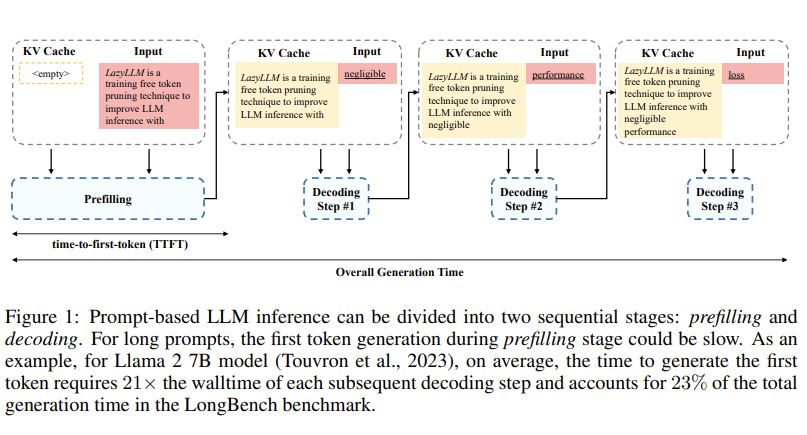
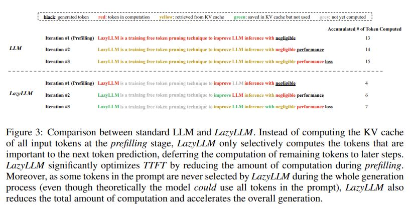
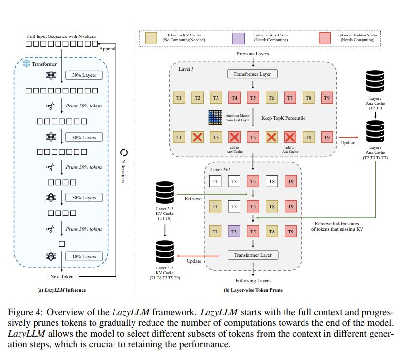

# LazyLLM: Dynamic Token Pruning for Efficient Long Context LLM Inference

## Core Idea
[kimi] LazyLLM方法
- LazyLLM通过在每个生成步骤中选择性地计算对下一个token预测重要的token的KV来工作，并且“懒惰地”将其余token的计算推迟到它们变得相关的后续步骤。
- 使用前一Transformer层的注意力分数来衡量token的重要性，并沿着Transformer的深度逐步剪枝token。
- 与提示压缩工作不同，LazyLLM的方法允许模型在所有生成步骤中复活先前剪枝的token，这对于保持准确性至关重要。
- 引入了Aux Cache（辅助缓存）机制，以缓存被剪枝token的隐藏状态，这使得复活被剪枝token的计算路径变得高效，并确保LazyLLM的最坏运行时间不会比基线慢。

## Core Image

## Useful Extensions
[知乎] [苹果、Meta发表的LazyLLM：用于高效长上下文LLM推理的动态token剪枝](https://zhuanlan.zhihu.com/p/712642779)