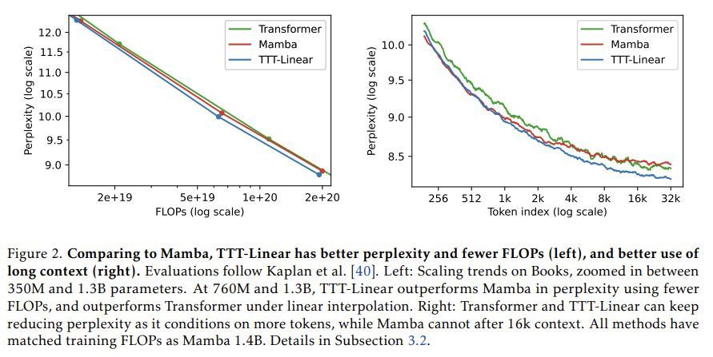
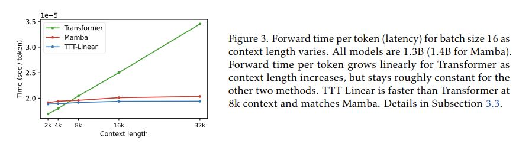
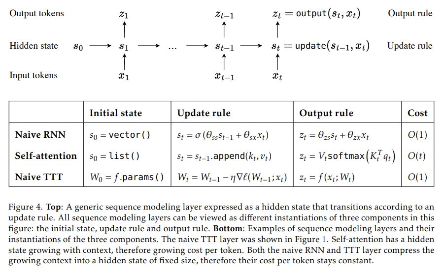

# Learning to (Learn at Test Time): RNNs with Expressive Hidden States

## Core Idea
[kimi] 这是一篇关于在测试时学习（Test-Time Training, TTT）的序列建模层的研究论文，提出了一种新的神经网络层，旨在改善长序列建模的性能。

**贡献**:
1. 提出了TTT层，这是一种新的序列建模层，其隐藏状态是模型本身，更新规则是自我监督学习。
2. TTT-Linear在不同参数规模的评估中优于Transformers和Mamba。
3. 通过mini-batch TTT和对偶形式，提高了TTT层的硬件效率，使TTT-Linear成为一个实用的大型语言模型构建块。

## Core Image

## Useful Extensions
[bilibili] [Learning to (Learn at Test Time)- RNNs with Expressive Hidden States(Stanford &_哔哩哔哩_bilibili](https://www.bilibili.com/video/BV1oi421h7Z3)