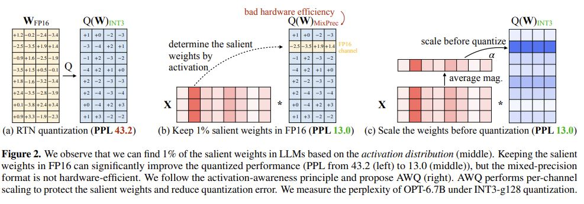
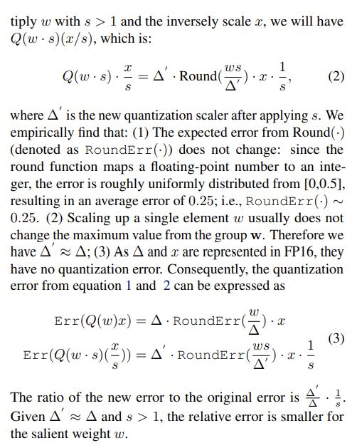

# AWQ: Activation-aware Weight Quantization for LLM Compression and Acceleration

## Core Idea
Contributions:  
- Improving LLM Quantization by Preserving 1% Salient Weights  
- Protecting Salient Weights by Activation-aware Scaling
  - the ratio compared to the original error RoundErr is ∆'/∆ · 1/s
  - also consider the error from the non-salient channels when protecting salient ones.

[kimi] 对比SmoothQuant

AWQ（Activation-aware Weight Quantization）和SmoothQuant是两种不同的量化方法，它们在量化的对象和目标上有所区别。

AWQ：
  - AWQ专注于对权重进行量化，而不直接对激活进行量化。
  - 它通过观察激活的分布来识别哪些权重是显著的，并为这些显著的权重通道找到最优的缩放因子，以减少量化过程中的误差。
  - AWQ的目标是在减少模型大小和加速推理的同时，尽可能保持模型的性能，特别是针对大型语言模型。

SmoothQuant：
  - SmoothQuant是一种同时量化激活和权重的方法。
  - 它通过设计一个平滑的量化函数来减少量化过程中的误差，这种方法旨在改善量化模型的整体性能。
  - SmoothQuant的目标是提高量化模型的准确性和效率，适用于各种类型的神经网络。

## Core Image

## Useful Extensions
Code: https://github.com/mit-han-lab/llm-awq

Integrated into NVIDIA TensorRT-LLM: https://github.com/NVIDIA/TensorRT-LLM