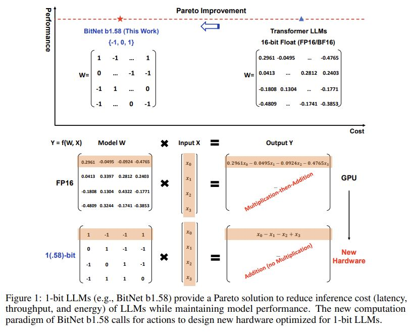

# The Era of 1-bit LLMs: All Large Language Models are in 1.58 Bits

## Core Idea

## Core Image

## Useful Extensions
[量化那些事之BitNet-b1.58](https://zhuanlan.zhihu.com/p/684658121)

[kimi] 三值化对比二值化

三值（-1, 0, 1）相比于二值（0, 1）的主要改进点在于增加了表示能力，这使得模型能够更精细地调整和学习数据的特征。以下是三值量化相比于二值量化的具体改进：

1. 更强的表示能力：三值量化增加了负值（-1），这为模型提供了额外的表示维度。在某些情况下，能够表示负值对于捕捉数据中的某些模式或关系可能是必要的，这可以提高模型对数据的理解能力。

2. 更细粒度的特征选择：通过引入0作为权重值，模型可以明确地忽略某些特征或神经元，这种显式的特征过滤机制可以在训练过程中帮助模型专注于更重要的特征，从而提高模型的性能。

3. 更接近原始数据的分布：在某些情况下，原始数据的分布可能包含负值或零值，使用三值量化可以更准确地保持这种分布，而不是简单地将所有负值或零值映射到单一的正值。

4. 减少量化误差：三值量化相比于二值量化可以减少量化误差，因为它提供了更多的量化级别来逼近原始的连续值。这种减少的量化误差有助于保持模型的性能，尤其是在对量化敏感的任务中。

5. 更灵活的优化策略：三值量化为模型提供了更多的优化空间，因为它允许在权重更新和梯度下降过程中有更多的灵活性。这可以帮助模型在训练过程中更好地适应数据的变化。

6. 提高模型的泛化能力：由于三值量化提供了更丰富的信息，模型可能能够更好地泛化到未见过的数据，尤其是在面对数据中的噪声和异常值时。

总的来说，三值量化相比于二值量化，通过增加一个额外的量化级别（即0），为模型提供了更强的表示能力和更细粒度的特征选择，这有助于提高模型的性能和泛化能力。