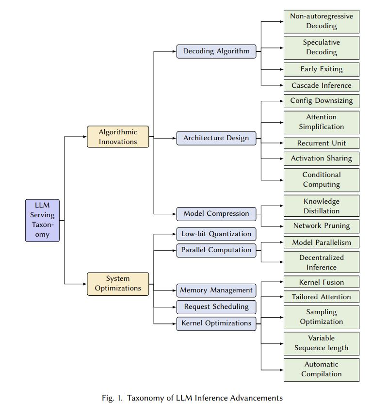
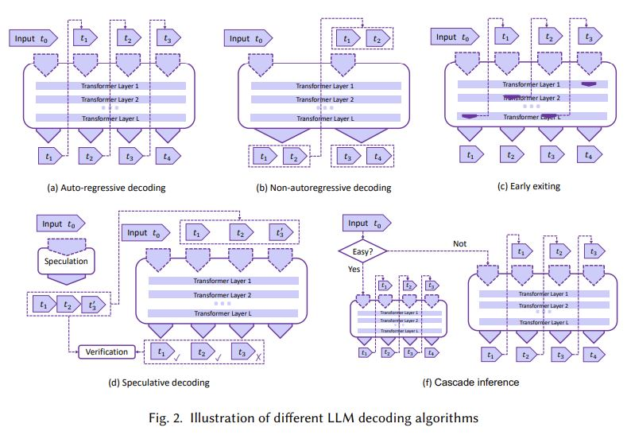
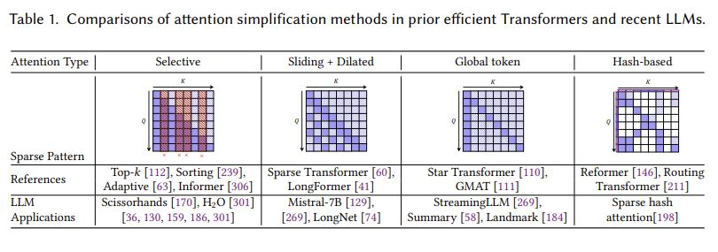
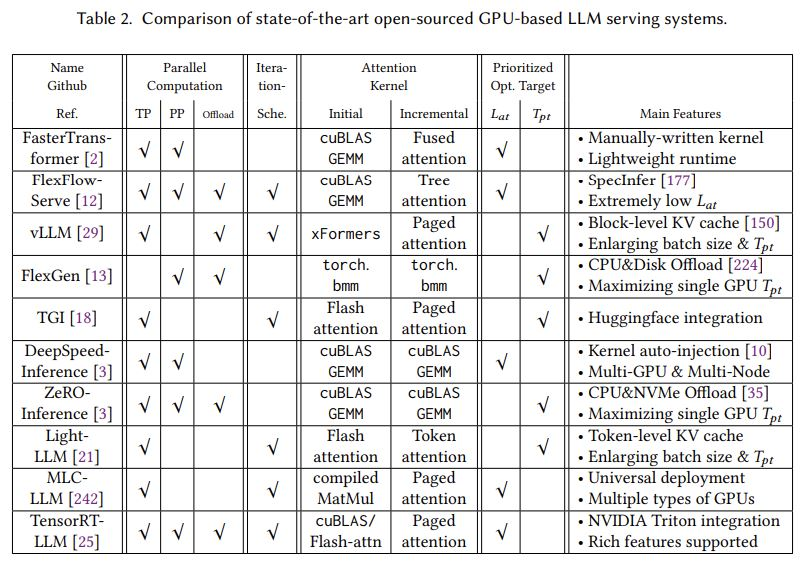

# Towards Efficient Generative Large Language Model Serving: A Survey from Algorithms to Systems

## Core Idea
1. Introduction
  - 1.1 Objectives
  - 1.2 Structure

2. Background
  - 2.1 Transformer-based LLM
  - 2.2 GPUs and Other Accelerators
  - 2.3 LLM Inference
  - 2.4 Challenges

3. Taxonomy
  - 3.1 Algorithmic Innovation
    - 3.1.1 Decoding Algorithm
      - Non-autoregressive Decoding
      - Speculative Decoding
      - Early Exiting
      - Cascade Inference
    - 3.1.2 Architecture Design
      - Configuration Downsizing
      - Attention Simplification
      - Activation Sharing
      - Conditional Computing
      - Recurrent Unit
    - 3.1.3 Model Compression
      - Knowledge Distillation
      - Network Pruning
  - 3.2 System Optimizations
    - 3.2.1 Low-bit Quantization
    - 3.2.2 Parallel Computation
      - Model Parallelism
      - Decentralized Inference
    - 3.2.3 Memory Management
    - 3.2.4 Request Scheduling
    - 3.2.5 Kernel Optimizations
      - Kernel Fusion
      - Tailored Attention
      - Sampling Optimization
      - Variable Sequence Length
      - Automatic Compilation

4. Software Frameworks

5. Benchmarks

6. Connection with Other Surveys

7. Future Direction

8. Conclusion

## Core Image

## Useful Extensions
[知乎] [大模型推理加速技术的学习路线是什么?](https://www.zhihu.com/question/591646269/answer/3360933376)